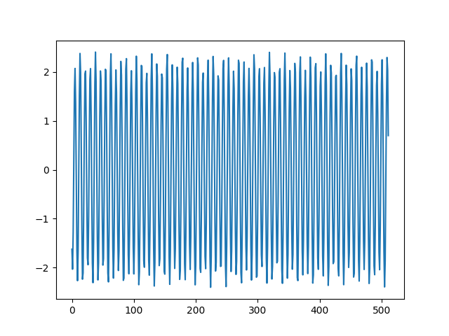

# Отчёт по расчётной работе «Дискретизация сигнала и его спектральный анализ».

***Студент: Еремеев Михаил***

***Группа: 3.9***

***Вариант: 4***

## Исходный сигнал

## Поиск частот и круговых частот гармонических составляющих аналогового сигнала (Картинка №1)

## Пики

x   | y
----|-----------------
40  | 48.3750907994730
62  | 564.927322652289
450 | 564.927322652289
472 | 48.3750907994730     

**Число гармоник: 2**

**Частоты соответственно 40 и 62**

**Круговые частоты 80 $\pi$ и 124 $\pi$ соответственно**
