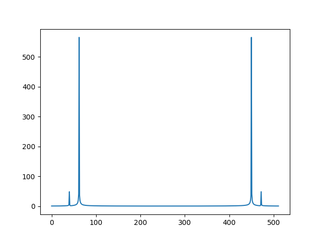
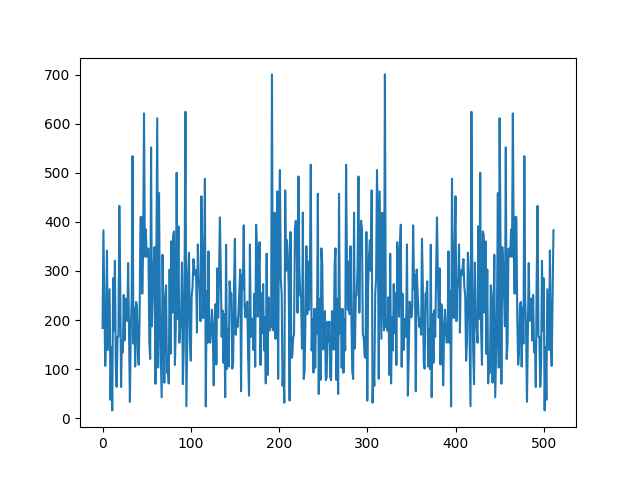
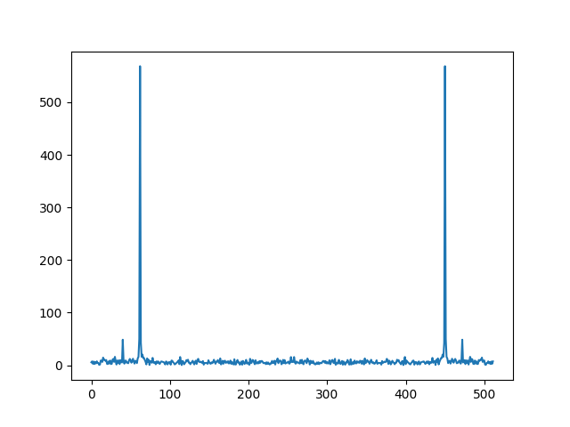
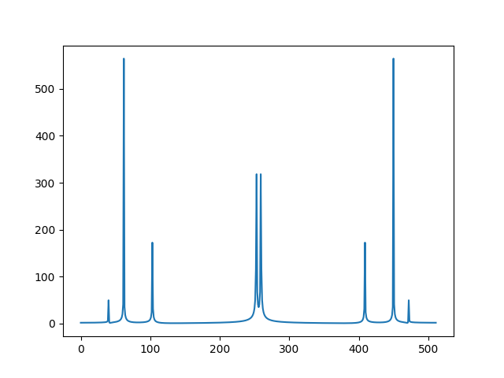
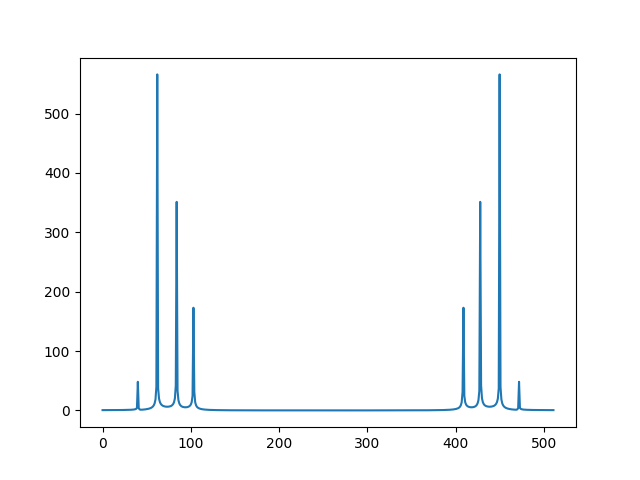
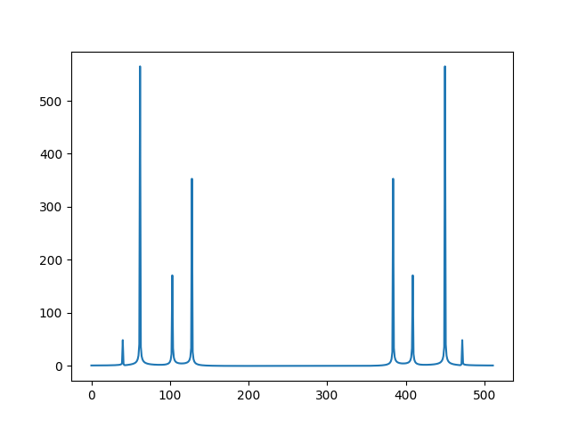
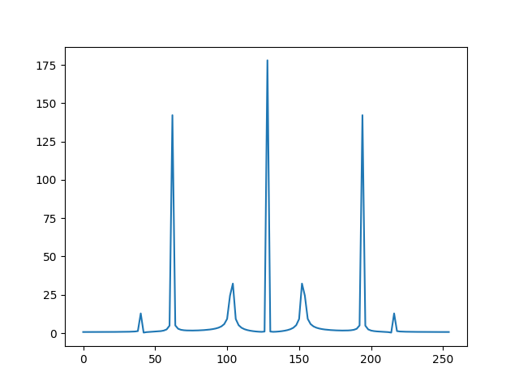

# Расчётная работа «Дискретизация сигнала и его спектральный анализ».

***Студент: Еремеев Михаил Вадимович***

***Группа: 3.9 ФИИТ***

***Вариант: 4***

## Поиск частот и круговых частот гармонических составляющих аналогового сигнала

**Пики**

x   | y
----|-----------------
40  | 48.3750907994730
62  | 564.927322652289
450 | 564.927322652289
472 | 48.3750907994730     

Число гармоник: **2** (= 4/2)

Частоты ***38.775521418347466*** и ***60.10205819843857*** **первой** и **второй** гармоник соответственно

Круговые частоты ***243.63378645398814*** и ***377.6323690036816*** **первой** и **второй** гармоник соответственно

## Добавление шума к исходному сигналу

Добавим к исходному сигналу шум с амплитудой равной **20.0**. Шум перекрывает всплески и определить частоты невозможно.

Теперь добавим к исходному сигналу шум с амплитудой равной **0.5**. Определить частоты удаётся так как шум не перекрывает всплески.

Энергия исходного сигнала равна ***1275.0032525450042***

Энергия шума равна ***41.479863469130706***

Энергия сигнала в ***31*** раз больше энергии шума

## Прибавление сигнала вида x(t)=A cos(Ω1) + 2Acos(Ω2), Ω1 < Ω2

A = 0.7

Ω1 = 100

Ω2 = 245

Алиасинг возникает при Ω2 = 248

Изменение порядка следования гармоник при увеличении значения частоты Ω2 до 415

## Уменьшение числа отсчётов в 2 раза

Взяты 512 отсчётов

Взяты 256 отсчётов (только четные отсчёты)

Алиасинг не возникает при 512 отсчётах но возникает при 256 отсчётах при частоте ***Ω2*** равной ***124***
